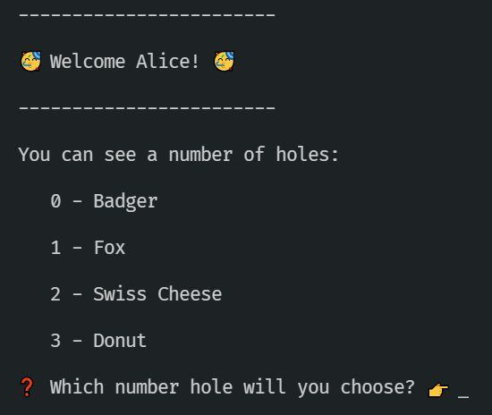

# Activity 1 - Enter the Rabbit Hole

## Incompatible Types

Following the White Rabbit down the rabbit hole sounds easy enough, right?



But no matter which hole you choose, you can't progress.

👉 Read the code in `1_rabbit_hole.ts`

There are TWO spots marked with a FIXME. Let's begin with the second one, which reads:

```JavaScript
// @ts-ignore 👉 FIXME ❌
```

That `@ts-ignore` sounds a little suspicious. In fact, this is a comment which switches off some TypeScript type protection! That's a huge red flag ⛳⛳⛳⛳😱 - something we should never consider doing.

👉 Delete the "ts-ignore" comment.

Now your app fails to compile! That sounds horrible but it's actually good news - TypeScript has found a problem for us.

👉 Hover the red squiggly line where the `ts-ignore` used to be.

"This condition will always return false since the types do not overlap"

🤔 Hmm. We need our hole to match 'Rabbit' but that's currently impossible.

👉 Look at the other FIXME at the top of the file, where we define our types for the different holes.

I'm sure you've figured it out already - we're not even defining a rabbit hole! TypeScript won't even let us compile the app since we've told it the hole NEEDS to be a Rabbit. It's catching the problem before our app has even run 💃🕺

👉 Add 'Rabbit' to the array of possible holes by the first FIXME.

Now you can choose 'Rabbit' and progress deeper into Wonderland 🥳

Let's see what's happening with the Cheshire Cat in [activity 2](./activity_2.md).
