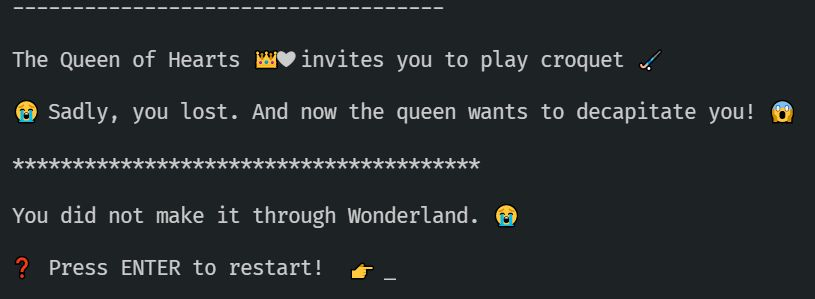

# Activity 4 - The Queen's Croquet

## Generics

In Wonderland, croquet is played by using a flamingo to push a hedgehog through an arch made of playing cards.

🏑 🦩 🦔 ♥♦♠♣

Of course!



👉 Read `4_croquet.ts`

Notice the generic `Croquet<T,U>` interface which operates on two generic types, one for the ball and one for the mallet. The `hit` function defined on the interface uses those types to figure out what is hitting what.

However, the Queen of Hearts hasn't set any limits on those generic types, so we can use anything as a mallet or ball. Currently we are using `number`, which doesn't seem right.

💡 Also notice the bottom of the file and see how we're checking for `string` types. Our custom `Ball` and `Mallet` types _don't actually exist at runtime_ - only when we're writing the code.

⚠️ If you are used to languages like C# and Java this can be a bit surprising, as you might expect to be able to use `typeof Ball` in TypeScript - but `Ball` doesn't exist when the code comes to run, as TypeScript transpiles down to JavaScript.

Bearing that in mind, let's pass the Queen's Croquet challenge!

# FIXME

Currently, the `Croquet<T,U>` interface is taking `<number, number>` rather than using our custom types for ball and mallet.

👉 At the first FIXME, we want to restrict the generic type in our interface. This is done using the `extends` keyword.

Change:

```TypeScript
interface Croquet<TBall, TMallet> {
	hit: (ball: TBall, mallet: TMallet) => boolean;
}
```

to:

```TypeScript
interface Croquet<TBall extends Ball, TMallet extends Mallet> {
	hit: (ball: TBall, mallet: TMallet) => boolean;
}
```

💡 `extends` adds a restriction to a generic type, saying that the type must inherit in some way from our specified type.

This is great! We want our ball to be a `Ball` and mallet to be a `Mallet`.

👉 Notice that this immediately breaks the parameters below - the numbers we were passing in are no longer the correct type.

👉 Change `<number, number>` to use the provided custom types `<Ball, Mallet>`

👉 Fix the parameters - TypeScript will only let you pass in one possible value for Ball, and one possible value for Mallet. The call will look like this:

```JavaScript
game.hit("Hedgehog", "Flamingo")
```

❗ At the time of writing the code, TypeScript understands that the custom type `Ball` is represented by the string "Hedgehog". But notice in the `hit` function below that _when the code actually runs_ the type is "string".

These two little changes are enough to pass by the croquet challenge.

# Lessons to take from this chapter:

⚠️ Our custom `Ball` and `Mallet` types use the `|` operator to allow a combination of values. In this case, they are just strings, but they could be user defined

-   Familiarity with generic syntax in interfaces and functions.

-   The custom types `Ball` and `Mallet` are really strings when the code is running.

Unfortunately, following our croquet victory, it's time to stand trial for theft in [activity 5](./activity_5.md).
