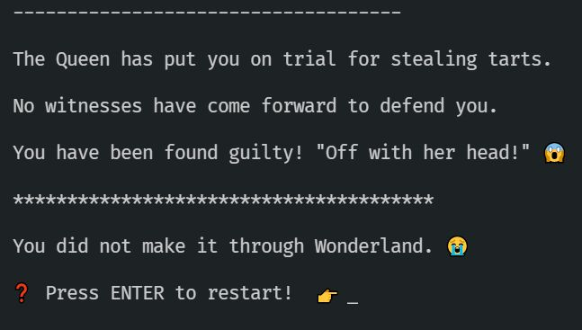

# Activity 5 - "Off with her head!"

## Functions

You've been falsely accused of stealing the Queen's tarts.



👉 Read `5_queen_of_hearts.ts`

👉 The first FIXME is:

```JavaScript
let witnesses = [];
```

This probably ought to call the `getWitnesses` function below.

```JavaScript
let witnesses = getWitnesses();
```

But what should that function look like?

👉 Currently the function signature is a bit useless:

```JavaScript
function getWitnesses(): any {
	return [];
}
```

`any` is always a bit suspicious in a TypeScript program. Writing `any` basically removes all of the usefulness of TypeScript.

🤔 What should this function return?

👉 Change the `any` return value to something useful...

...

...

...

```JavaScript
function getWitnesses(): Array<Witness> {
	return [];
}
```

❗ You could also use `Witness[]` - they're the same thing!

👉 Update the `getWitnesses` function to return enough witnesses. Include `The March Hare`, `The Mad Hatter`, `The White Rabbit` and `The Cheshire Cat`.

👉 Notice the `giveEvidence` function that each witness requires. The signature is `() => Verdict`, i.e. the function takes no parameters and returns a verdict.

👉 Try making some of the witnesses give a Guilty verdict (or a random verdict) and see what happens.

👉 Finally, make sure each verdict is Not Guilty.

This should be enough to pass the trial! If you're struggling, here's a potential solution for `getWitnesses`:

```JavaScript
return [
		{
			name: 'The Mad Hatter',
			giveEvidence: () => 'Not Guilty',
		},
		{
			name: 'The March Hare',
			giveEvidence: () => 'Not Guilty',
		},
		{
			name: 'The Cheshire Cat',
			giveEvidence: () => 'Not Guilty',
		},
		{
			name: 'The White Rabbit',
			giveEvidence: () => 'Guilty',
		},
	];
```

Time to leave Wonderland in [activity 6](./activity_6.md).
