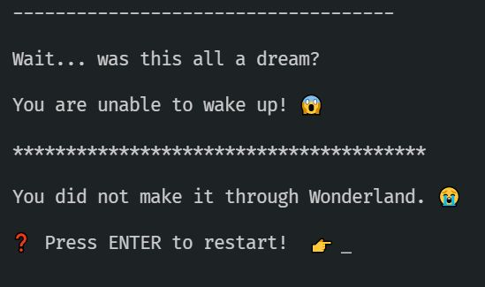

# Activity 6 - Time to Wake Up

## Optional Properties



👉 Read `6_wake_up.ts`

It looks like our `tryToWakeUp()` function isn't returning whatever we need it to.

The condition to meet is this:

```JavaScript
awoken.wake?.wake?.wake?.canWake === 'Yes'
```

That's a LOT of optional properties, but scrolling up we can see the `interface` definitions that are causing this. Each type has an optional property called `wake`. The `?.` operator accesses it if it's available, if not then the condition will resolve to `false`.

So we just need to adjust the `tryToWakeUp()` output so it meets the criteria.

👉 Change the return value of `tryToWakeUp` so accessing `.wake?.wake?.wake?.canWake` will result in the string "Yes".

❗ NB because we've defined this in our interfaces, TypeScript will help you! Start by adding a "wake" property inside the return object:

```JavaScript

return {
	wake: {

	};
```

In VSCode, Autocomplete ought to help you out. Adding a wake property inside that should also trigger autocomplete:

return {
wake: {
wake: {

    	}
    };

````

And so on... eventually you will reach the final interface which has a `string` property called `canWake`:

```JavaScript

return {
	wake: {
		wake: {
			wake: {
				canWake: 'Yes',
				},
			},
		},
	};
````

This object meets the condition and you will be able to wake up!

This is a confusingly-designed interface structure - in the real world our interfaces should be less repetitive than those required to escape from a magical Wonderland dreamworld. But even with this horrible interface structure the tools are working in our favour as they help us to autocomplete our way to the right object shape to meet the condition.

## Congratulations

You've had a chance to play with TypeScript features and syntax. In the process you've seen some poor choices - confusing interface structures, bad choices of generic functions. And you've seen some ways that TypeScript makes it easy to work even with these bad choices!

# Extension

Can you take some JavaScript you've written elsewhere and convert it to TypeScript? How would you make _good_ use of the TypeScript features? Even something as simple as adding parameter type checking can make JavaScript programs much easier to work with.
